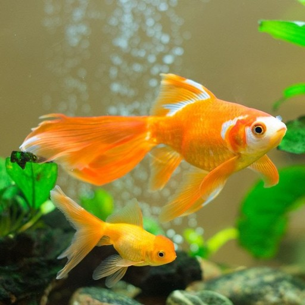
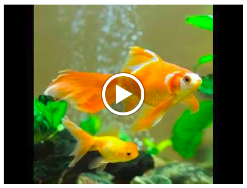

# Simulation Of UnderWater Images in Unidirectional Cyclic Wave(UCW) 

[![Build Status][travis-image]][travis-url]

## Result

### Input Image 

## Acknowledgement

- All the coding part is done by **Jerin Geo James**

<!-- Markdown link & img dfn's -->
[travis-image]: https://img.shields.io/travis/dbader/node-datadog-metrics/master.svg?style=flat-square
[travis-url]: https://travis-ci.org/dbader/node-datadog-metrics

